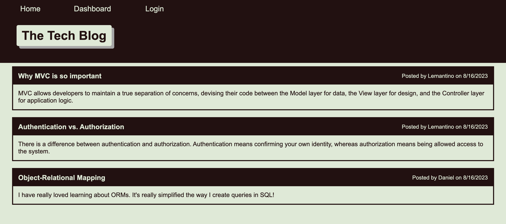

# TechBlog
  
  
  ## Description:
  A CMS-style blog site similar to a Wordpress site, where developers can publish their blog posts and comment on other developers’ posts as well.

  
  
  ## Table of Contents:
  
  ## Questions:
  
  For any additional questions:
  
  Email:
  djamiranda@gmail.com
  
  GitHub:
  [https://github.com/djamiranda](https://github.com/djamiranda)
  
  Repo:
  [https://github.com/djamiranda/TechBlog](https://github.com/djamiranda/TechBlog)

  Heroku:
  

